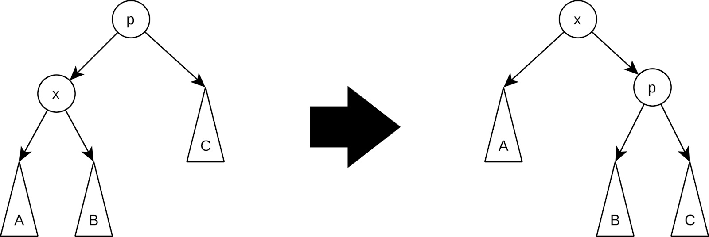

# **Розширюване дерево**

[Розширюване дерево](https://uk.wikipedia.org/wiki/%D0%A0%D0%BE%D0%B7%D1%88%D0%B8%D1%80%D1%8E%D0%B2%D0%B0%D0%BD%D0%B5_%D0%B4%D0%B5%D1%80%D0%B5%D0%B2%D0%BE) (сплай-дерево, *splay tree*) — це самозбалансоване бінарне дерево пошуку, яке забезпечує амортизовану складність $O(\log n)$ для основних операцій (вставка, видалення, пошук).

Воно було розроблено в 1985 році Деніелом Слітором і Робертом Тар’яном. У більшості випадків операції мають часову складність $O(\log n)$, хоча можуть виникати й гірші випадки з часовою складністю $O(n)$.
Іншими словами, хоча в найгіршому випадку час виконання окремих операцій може сягати

$O(n)$, амортизована, усереднена для серії операцій складність залишається $O(\log n)$. Це означає, що навіть при кількох невдалих запитах дерево в цілому залишається ефективним для великої кількості операцій.

**Основна особливість розширюваних дерев** — підняття вузлів до кореня після доступу, що робить часто запитувані вузли доступнішими. Кожного разу, коли до вузла звертаються (під час пошуку, вставки чи видалення), цей вузол стає **коренем дерева** завдяки операції **сплай (splay)**. Це досягається шляхом виконання серії ротацій (обертання вузлів). Мета цієї стратегії — зробити доступ до часто використовуваних елементів швидшим.

Нижче в таблиці наведемо порівняння розширюваних дерев з іншими деревами

| Характеристика | Сплай-дерево | AVL-дерево | Червоно-чорне дерево |
| --- | --- | --- | --- |
| **Балансування** | Динамічне | Статичне | Статичне |
| **Складність вставки** | $O(\log n)$ | $O(\log n)$ | $O(\log n)$ |
| **Складність пошуку** | Амортизована — $O(\log n)$ | $O(\log n)$ | $O(\log n)$ |
| **Реалізація** | Проста | Складніша | Складніша |
| **Адаптивність** | Висока | Низька | Низька |

Головна мета Splay tree полягає не у строгому балансуванні дерева, а в **забезпеченні швидкого доступу до елементів, які активно використовуються**. Це досягається без необхідності у складних додаткових операціях для підтримки рівноваги, що є типовим для AVL або червоно-чорних дерев. Таким чином, розширюване дерево забезпечує природне балансування, яке адаптується до шаблону доступу.

Важливою особливістю є те, що після виконання ротацій зберігаються властивості бінарного дерева пошуку. Порядок елементів під час обхідного (in-order) перегляду дерева залишається незмінним, що гарантує правильність роботи алгоритмів пошуку та вставки.

### Пошук елемента в розширюваному дереві

Процес пошуку в розширюваному дереві починається так само, як і у звичайному бінарному дереві пошуку — шляхом порівняння шуканого елемента зі значенням вузла. Однак щойно елемент знайдено, запускається спеціальна операція — **сплаювання**, яка переміщує цей вузол до кореня дерева. Ця процедура досягається завдяки серії ротацій.

Головна мета сплаювання — це не балансування дерева, як, наприклад, в AVL-дереві, а **оптимізація доступу до недавно використаних елементів**. Завдяки сплаюванню вузол, який тільки-но було знайдено, стає коренем, що дозволяє значно скоротити час його подальшого доступу.

Особливість такої організації полягає в тому, що при повторних пошуках одного й того самого елемента час доступу може скоротитися до $O(1)$. Це робить Splay Trees надзвичайно ефективними у сценаріях, де певні елементи запитуються набагато частіше за інші.

Сплай-операція в розширюваному дереві виконується для переміщення вузла до кореня. Цей процес базується на серії ротацій і може включати один із трьох основних типів ситуацій: **Zig**, **Zig-Zig** і **Zig-Zag**. Вибір конкретної ситуації залежить від положення вузла відносно його батьківського і прабатьківського вузлів.

**Zig-ситуація**

**Zig-ситуація** виникає, коли **вузол є дочірнім вузлом безпосереднього кореня дерева**. Це найпростіший тип ротації, який застосовується в певних умовах, коли ми намагаємось підняти елемент дерева ближче до кореня.



На картинці ми бачимо такі елементи:

- `p` — це поточний корінь дерева, або батьківський вузол, який розташований вище в ієрархії.
- `x` — це вузол, який ми бажаємо підняти до кореня дерева. Згідно з Zig-правилом, `x` є прямим дочірнім вузлом для `p`.
- `A`, `B`, `C` — це піддерева. Вони представляють будь-які можливі елементи дерева, що можуть бути самі по собі піддеревами, і важливо звернути увагу на те, що їх порядок має бути збережено.

Тож Zig-ситуація виникає, коли вузол `x`, який ми намагаємося підняти до кореня, є дочірнім вузлом для кореневого вузла `p`. Іншими словами, `x` є лівим або правим дочірнім вузлом для `p`, і саме `p` є коренем дерева. У цьому випадку ми виконуємо просту ротацію, щоб підняти `x` і зробити його новим коренем дерева.

Взагалі можливі дві ситуації:

1. Якщо вузол є лівим дочірнім вузлом, виконується **права ротація**. Ця операція піднімає вузол до кореня, а початковий корінь стає його правим дочірнім вузлом.
2. Якщо вузол є правим дочірнім вузлом, виконується **ліва ротація**. У цьому випадку вузол стає коренем, а початковий корінь переміщується на позицію лівого дочірнього вузла.

На картинці представлена ротація, що піднімає `x` на рівень вище, а `p` опускає нижче. У цьому випадку ми бачимо просту праву ротацію, яка робить `x` новим коренем дерева, а `p` стає правим дочірнім вузлом для `x`.

Початковий стан — це ліва частина зображення. Елемент `p` є коренем дерева й має два дочірні вузли: `x` зліва та `C` справа. Вузол `x` у свою чергу має два дочірні піддерева: `A` та `B`.

Ціль ротації — підняти `x` на місце кореня дерева, зробивши його новим коренем. Опустити `p`, зробивши його дочірнім вузлом для `x`.

**Ротація, або процес зміни зв'язків, відбувається в такий спосіб:**

- `x` піднімається на рівень вище і стає новим коренем дерева.
- `p` переміщується до правого дочірнього вузла для `x`.
- Піддерево `B`, яке раніше було правим дочірнім піддеревом для `x`, стає лівим піддеревом для `p`.
- `A` залишається лівим піддеревом для `x`.
- `C` залишається правим піддеревом для `p`.

Таким чином, ротація привела до того, що вузол `x`, який ми хотіли підняти, став коренем, а `p` опинився нижче, змінивши свій рівень.  
Завдяки Zig-ситуації переміщення вузла до кореня відбувається дуже швидко — всього за одну операцію. Цей випадок особливо корисний, коли вузол, який необхідно перемістити, вже знаходиться у верхніх рівнях дерева.

**Zig-Zig-ситуація**

**Zig-Zig-ситуація** відбувається, коли **вузол,** який ми намагаємося підняти до кореня, **розташований як дочірній елемент двох послідовних лівих або правих дочірніх зв'язків.** У цьому випадку ми повинні виконати подвійну ротацію, яка називається Zig-Zig.

.jpg)

На картинці ми бачимо такі елементи:

- `g` — це вузол, який на момент початку ротації є «дідусем» вузла `x`.
- `p` — це батьківський вузол для `x`.
- `x` — це вузол, який ми бажаємо підняти ближче до кореня.
- `A`, `B`, `C`, `D` — це піддерева, що представляють усі можливі підвузли й самі можуть бути складними структурами.

Чому саме ротація називається Zig-Zig? Бо ми виконуємо дві послідовні ротації в одному напрямку для підняття вузла `x`.
На картинці показаний приклад для лівої Zig-Zig-ротації, що виникає, коли вузол `x` знаходиться зліва від свого батька `p`, а `p` знаходиться зліва від свого батька `g`. Для подвійно правого випадку процес дзеркальний: виконуються дві ліві ротації.

Ціль полягає в тому, щоб підняти `x` до кореня, що дозволяє вирівняти дерево таким чином, що вузол, який ми часто запитуємо, опиняється на меншій глибині, чим зменшує час доступу до нього.

Давайте детальніше розглянемо **процес цієї ротації крок за кроком**.

На лівому зображенні міститься початковий стан дерева, де `g` є кореневим вузлом дерева і має два дочірні підвузли: `p` зліва і `D` справа. Вузол `p` також має два дочірні вузли: `x` зліва і `C` справа. Вузол `x` має два піддерева: `A` зліва і `B` справа.

Отже, мета ротації — підняти вузол `x`, зробивши його новим коренем, і зробити так, щоб `p` і `g` перемістилися нижче, зберігаючи їхню ієрархію та піддерева.

Перший крок ротації — це ротація між вузлами `g` та `p`. Ми виконуємо ротацію між `g` та `p`, щоб `p` став новим коренем. Вузол `g` переміщається на праве дочірнє місце для `p`. Піддерево `C`, яке було правим дочірнім для `p`, тепер стає лівим піддеревом для `g`.

Наступний крок — це ротація між `p` та `x`. Тепер ми виконуємо ротацію між `p` та `x`, щоб `x` став новим коренем. Вузол `p` переміщується на праве дочірнє місце для `x`. Піддерево `B`, яке було правим дочірнім для `x`, тепер стає лівим піддеревом для `p`.

У такий спосіб ми приходимо до кінцевого стану, де вузол `x` тепер є коренем (праве зображення).

Ротація Zig-Zig піднімає вузол `x` одразу на два рівні вгору, що значно скорочує шлях до нього при подальших запитах. Завдяки подвійній ротації ми вирівнюємо дерево в такий спосіб, що зменшуємо глибину вузла `x`, а отже, і середній час доступу до нього.

Отже, Zig-Zig-ротація дозволяє мінімізувати шлях до конкретного вузла шляхом його агресивного підйому вгору за допомогою послідовних ротацій, забезпечуючи більш збалансовану структуру дерева й підвищуючи ефективність запитів.

**Zig-Zag-ситуація**

**Zig-Zag-ротація** має особливий випадок, коли **вузол**, який ми намагаємося підняти, **розташований як лівий або правий дочірній для свого батьківського вузла, який у свою чергу є дочірнім елементом у протилежному напрямку від «дідуся».** Це означає, що вузол, який ми піднімаємо, і його батьківський вузол знаходяться в різних напрямках відносно своїх батьків, утворюючи зигзаг у структурі дерева.

.jpg)

На картинці ми бачимо такі елементи:

- `g` — це вузол на вершині, тобто «дідусь» вузла `x`.
- `p` — це батьківський вузол для `x`.
- `x` — це вузол, який ми хочемо підняти вище, наблизити його до кореня дерева.
- `A`, `B`, `C`, `D` — це піддерева, що можуть бути підструктурами, які зберігаються при виконанні ротації.

Сама Zig-Zag-ротація виконується у випадку, коли `x` і `p` знаходяться в різних напрямах відносно своїх батьків.

Наприклад:

- `p` є лівим дочірнім вузлом для `g`.
- `x` є правим дочірнім вузлом для `p`.

Або навпаки:

- `p` є правим дочірнім вузлом для `g`.
- `x` є лівим дочірнім вузлом для `p`.

Мета ротації — підняти вузол `x` вище, зробивши його новим коренем, зберегти структуру піддерев і уникнути асиметрії.

Сам процес Zig-Zag-ротації є симетричним і працює однаково для випадків «лівий-правий» або «правий-лівий». Такий підхід дозволяє зберігати властивості бінарного дерева пошуку й мінімізувати висоту дерева, що покращує доступ до вузлів у майбутніх операціях.

Спочатку виконується ротація між вузлами `p` та `x` так, щоб вузол `x` став новим батьківським вузлом для `p`. Таким чином, `B` стає лівим піддеревом для `p`, а `p` — лівим дочірнім для `x`. Далі виконується ротація між вузлами `g` та `x`, де вузол `x` стає новим коренем або вищим вузлом, а вузол `g` переміщується праворуч під `x`. Після цього піддерево `C`, яке було правим дочірнім вузлом для `x`, стає лівим дочірнім вузлом для `g`.

Так ми приходимо в кінцевий стан (праве зображення). Таким чином, Zig-Zag-ротація усуває асиметрію, спричинену зигзагом, і дозволяє зменшити глибину часто запитуваних вузлів, що значно підвищує ефективність роботи дерева в цілому.

### Реалізація

Розглянемо програмну реалізацію Splay Tree.

```python
class Node:
    def __init__(self, data, parent=None):
        self.data = data
        self.parent = parent
        self.left_node = None
        self.right_node = None

class SplayTree:
    def __init__(self):
        self.root = None

    def insert(self, data):
        """Вставка нового елемента в дерево."""
        if self.root is None:
            self.root = Node(data)
        else:
            self._insert_node(data, self.root)

    def _insert_node(self, data, current_node):
        """Рекурсивна вставка елемента в дерево."""
        if data < current_node.data:
            if current_node.left_node:
                self._insert_node(data, current_node.left_node)
            else:
                current_node.left_node = Node(data, current_node)
        else:
            if current_node.right_node:
                self._insert_node(data, current_node.right_node)
            else:
                current_node.right_node = Node(data, current_node)

    def find(self, data):
        """Пошук елемента в дереві із застосуванням сплаювання."""
        node = self.root
        while node is not None:
            if data < node.data:
                node = node.left_node
            elif data > node.data:
                node = node.right_node
            else:
                self._splay(node)
                return node.data
        return None  # Якщо елемент не знайдено.

    def _splay(self, node):
        """Реалізація сплаювання для переміщення вузла до кореня."""
        while node.parent is not None:
            if node.parent.parent is None:  # Zig-ситуація
                if node == node.parent.left_node:
                    self._rotate_right(node.parent)
                else:
                    self._rotate_left(node.parent)
            elif node == node.parent.left_node and node.parent == node.parent.parent.left_node:  # Zig-Zig
                self._rotate_right(node.parent.parent)
                self._rotate_right(node.parent)
            elif node == node.parent.right_node and node.parent == node.parent.parent.right_node:  # Zig-Zig
                self._rotate_left(node.parent.parent)
                self._rotate_left(node.parent)
            else:  # Zig-Zag
                if node == node.parent.left_node:
                    self._rotate_right(node.parent)
                    self._rotate_left(node.parent)
                else:
                    self._rotate_left(node.parent)
                    self._rotate_right(node.parent)

    def _rotate_right(self, node):
        """Права ротація вузла."""
        left_child = node.left_node
        if left_child is None:
            return

        node.left_node = left_child.right_node
        if left_child.right_node:
            left_child.right_node.parent = node

        left_child.parent = node.parent
        if node.parent is None:
            self.root = left_child
        elif node == node.parent.left_node:
            node.parent.left_node = left_child
        else:
            node.parent.right_node = left_child

        left_child.right_node = node
        node.parent = left_child

    def _rotate_left(self, node):
        """Ліва ротація вузла."""
        right_child = node.right_node
        if right_child is None:
            return

        node.right_node = right_child.left_node
        if right_child.left_node:
            right_child.left_node.parent = node

        right_child.parent = node.parent
        if node.parent is None:
            self.root = right_child
        elif node == node.parent.left_node:
            node.parent.left_node = right_child
        else:
            node.parent.right_node = right_child

        right_child.left_node = node
        node.parent = right_child

if __name__ == '__main__':
    splay_tree = SplayTree()
    splay_tree.insert(10)
    splay_tree.insert(8)
    splay_tree.insert(3)
    splay_tree.insert(7)

    print("Accessing 7:", splay_tree.find(7))
    print("Accessing 3:", splay_tree.find(3))
    print("Accessing 8:", splay_tree.find(8))
    print("Accessing 3:", splay_tree.find(3))
    print("Root after operations:", splay_tree.root.data)
```

Клас `Node` представляє вузол дерева й містить атрибути:

- `data` — значення вузла,
- `parent` — посилання на батьківський вузол,
- `left_node` — посилання на лівий дочірній вузол,
- `right_node` — посилання на правий дочірній вузол.

Основний клас `SplayTree` реалізує всі операції з деревом. Він містить кореневий вузол `root`, а також методи для вставки `insert`, пошуку `find` та обертання вузлів `_rotate_right`, `_rotate_left`. Давайте детально розглянемо кожен з них.

Метод `insert` виконує додавання нового елемента в дерево:

```python
def insert(self, data):
        """Вставка нового елемента в дерево."""
        if self.root is None:
            self.root = Node(data)
        else:
            self._insert_node(data, self.root)

    def _insert_node(self, data, current_node):
        """Рекурсивна вставка елемента в дерево."""
        if data < current_node.data:
            if current_node.left_node:
                self._insert_node(data, current_node.left_node)
            else:
                current_node.left_node = Node(data, current_node)
        else:
            if current_node.right_node:
                self._insert_node(data, current_node.right_node)
            else:
                current_node.right_node = Node(data, current_node)
```

Якщо дерево порожнє, новий елемент стає коренем. Інакше викликається приватний метод `_insert_node`, який рекурсивно проходить по дереву, щоб знайти правильне місце для нового вузла. Новий вузол додається або зліва, або справа, залежно від значення даних, порівняно з поточним вузлом.

Метод `find` виконує пошук елемента в дереві:

```python
    def find(self, data):
        """Пошук елемента в дереві із застосуванням сплаювання."""
        node = self.root
        while node is not None:
            if data < node.data:
                node = node.left_node
            elif data > node.data:
                node = node.right_node
            else:
                self._splay(node)
                return node.data
        return None  # Якщо елемент не знайдено.
```

Починається з кореня і проходить по дереву, порівнюючи значення поточного вузла з тим, що шукаємо. Якщо знайдено відповідний вузол, викликається метод `_splay`, який переміщує цей вузол до кореня за допомогою ротацій. Якщо елемент не знайдено, повертається `None`.

Метод `_splay` відповідає за те, щоб підняти певний вузол до кореня дерева.

```python
def _splay(self, node):
        """Реалізація сплаювання для переміщення вузла до кореня."""
        while node.parent is not None:
            if node.parent.parent is None:  # Zig-ситуація
                if node == node.parent.left_node:
                    self._rotate_right(node.parent)
                else:
                    self._rotate_left(node.parent)
            elif node == node.parent.left_node and node.parent == node.parent.parent.left_node:  # Zig-Zig
                self._rotate_right(node.parent.parent)
                self._rotate_right(node.parent)
            elif node == node.parent.right_node and node.parent == node.parent.parent.right_node:  # Zig-Zig
                self._rotate_left(node.parent.parent)
                self._rotate_left(node.parent)
            else:  # Zig-Zag
                if node == node.parent.left_node:
                    self._rotate_right(node.parent)
                    self._rotate_left(node.parent)
                else:
                    self._rotate_left(node.parent)
                    self._rotate_right(node.parent)
```

Використовуються три види операцій:

- Zig-ситуація, коли вузол `x` є дочірнім вузлом кореневого вузла. Тут використовується проста ротація `_rotate_left` або `_rotate_right`.
- Zig-Zig-випадок, коли вузол і його батько обидва є лівими або правими дочірніми вузлами у відношенні до їхніх батьків. Виконується дві однакові ротації поспіль: `_rotate_right` двічі або `_rotate_left` двічі.
- Zig-Zag-випадок, коли вузол і його батько розміщені у протилежних напрямках: один лівий, інший правий. Виконується спочатку одна ротація у протилежний бік: `_rotate_right` або `_rotate_left`, потім — друга в інший бік.

Функція `_rotate_right` виконує праву ротацію для заданого вузла:

```python
def _rotate_right(self, node):
        """Права ротація вузла."""
        left_child = node.left_node
        if left_child is None:
            return

        node.left_node = left_child.right_node
        if left_child.right_node:
            left_child.right_node.parent = node

        left_child.parent = node.parent
        if node.parent is None:
            self.root = left_child
        elif node == node.parent.left_node:
            node.parent.left_node = left_child
        else:
            node.parent.right_node = left_child

        left_child.right_node = node
        node.parent = left_child
```

Змінна `left_child` — це лівий дочірній вузол, який ми хочемо підняти. Якщо `left_child` існує, ми переосмислюємо зв'язки:

- Вузол `node` стає правим дочірнім для свого лівого дочірнього.
- Вузол `left_child` стає новим коренем або дочірнім для батьківського вузла `node`.

Ми також корегуємо вказівники на батьківські та дочірні вузли, щоб забезпечити правильні зв'язки в дереві.

Аналогічно правій ротації, ліва ротація _rotate_left працює з правим дочірнім вузлом:

```python
def _rotate_left(self, node):
        """Ліва ротація вузла."""
        right_child = node.right_node
        if right_child is None:
            return

        node.right_node = right_child.left_node
        if right_child.left_node:
            right_child.left_node.parent = node

        right_child.parent = node.parent
        if node.parent is None:
            self.root = right_child
        elif node == node.parent.left_node:
            node.parent.left_node = right_child
        else:
            node.parent.right_node = right_child

        right_child.left_node = node
        node.parent = right_child
```

Змінна `right_child` — це правий дочірній вузол, який ми хочемо підняти. Вузол `node` стає лівим дочірнім для свого правого дочірнього. Вузол `right_child` стає новим коренем або дочірнім вузлом для батьківського вузла `node`. Усі відповідні вказівники на дочірні вузли корегуються.

Тепер розглянемо виконання коду. Ми спочатку вставляємо кілька елементів: `10`, `8`, `3`, `7`.

```python
splay_tree = SplayTree()
splay_tree.insert(10)
splay_tree.insert(8)
splay_tree.insert(3)
splay_tree.insert(7)
```

Отримуємо таке Splay дерево.


Далі ми здійснюємо послідовний пошук елементів. Після кожного успішного пошуку елемент піднімається до кореня за допомогою сплаювання.

Рядок коду `print("Accessing 7:", splay_tree.find(7))` змінює дерево таким чином.


Рядок коду `print("Accessing 3:", splay_tree.find(3))`:


Рядок коду `print("Accessing 8:", splay_tree.find(8))`:


І повторне звертання до вузла 3, рядок `print("Accessing 3:", splay_tree.find(3))`, поверне його в корінь дерева.


Під час роботи відбувається самобалансування. Сплаювання забезпечує те, що вузли, які часто використовуються, стають ближчими до кореня. Це знижує середню глибину й покращує середній час доступу.
Splay Tree не вимагає підтримки додаткових балансувальних значень, як, наприклад, AVL Tree чи червоно-чорні дерева, що робить код легшим у підтримці.

Але навіть на нашому простому прикладі помітно, що при певних послідовностях вставки та доступу Splay Tree може деградувати до лінійного списку, що збільшує час виконання до $O(n)$ для операцій. Тож треба розуміти, що Splay Tree не гарантує абсолютне балансування, а лише намагається оптимізувати доступ до часто запитуваних елементів.

Загалом Splay Tree забезпечує амортизований час виконання $O(\log n)$ для основних операцій, таких як вставка, видалення й пошук. Це робить Splay Tree ефективним для використання у сценаріях з частими повторюваними запитами, але він може бути менш ефективним у випадках, коли потрібен гарантований баланс і час виконання операцій.

### Практичне застосування

Розширюване дерево має досить багато практичних застосувань у різних сферах, де потрібен швидкий доступ до даних із можливістю адаптації до умов, що змінюються.

Одне з ключових застосувань Splay Trees — **кешування**, яке є основою сучасних комп'ютерних систем для прискорення доступу до часто використовуваних даних. Кеш, чи то апаратний, чи програмний компонент, зберігає дані для повторного швидкого доступу, що знижує час виконання операцій.

Splay Trees ідеально підходять для реалізації кешу завдяки їхній здатності адаптуватися до частоти запитів. Після кожного доступу вузол з даними переміщується до кореня дерева, завдяки чому найбільш «популярні» елементи завжди залишаються у верхній частині. Це забезпечує швидкий доступ до часто запитуваних даних.

Наприклад, у вебсерверах або файлових системах Splay Trees можуть суттєво зменшити час доступу до популярних файлів чи сторінок, які запитуються набагато частіше за інші. Такий підхід дозволяє оптимізувати продуктивність системи, зосереджуючи ресурси на найважливіших операціях.

Ще одним можливим напрямком застосування Splay Trees є **алгоритми збору сміття (garbage collection**), що використовуються в мовах програмування з динамічним керуванням пам’яттю. Ця процедура автоматично видаляє об’єкти, які більше не використовуються, звільняючи пам’ять для нових завдань. Завдяки властивостям Splay Trees вузли, які запитуються рідко, поступово опускаються до листків дерева. Таким чином, найменш часто використовувані об'єкти стають легкодоступними для видалення. Це значно скорочує витрати ресурсів на пошук таких об’єктів, підвищуючи ефективність алгоритмів збору сміття.

Splay Trees також застосовуються в мережевих технологіях, зокрема в **маршрутизації IP-адрес.** У комп'ютерних мережах маршрутизатори обробляють великі обсяги пакетів даних, вирішуючи, куди надсилати кожен із них, на основі IP-адрес.

Самоадаптивна природа Splay Trees дозволяє ефективно працювати з принципом локальності доступу. Якщо певна IP-адреса вже була оброблена, ймовірність повторного використання цієї адреси в запитах дуже висока. Завдяки цьому вузли з нещодавно використаними IP-адресами переміщуються ближче до кореня дерева, що забезпечує доступ до них за майже миттєвий час.

Таким чином, Splay Trees є потужним інструментом у сценаріях, де шаблони доступу постійно змінюються, а певні дані використовуються частіше за інші. Їхня самоадаптивна природа дає змогу суттєво покращити продуктивність у задачах кешування, керування пам’яттю та маршрутизації даних, що робить цю структуру незамінною для багатьох сфер сучасної комп'ютерної науки.

Для роботи з розширюваним деревом існують бібліотеки, які можуть спростити їх реалізацію та інтеграцію у проєкти.

Для Python бібліотека [**PyBST**](https://github.com/TylerSandman/py-bst) пропонує реалізацію різних типів дерев пошуку, зокрема AVL, червоно-чорні дерева. Вона надає такі класи дерев:

- `BSTree` представляє незбалансоване бінарне дерево пошуку;
- `AVLTree` — збалансоване AVL-дерево;
- `SplayTree` — скореговане Splay-дерево;
- `RBTree` — збалансоване червоно-чорне дерево.

Реалізацію розширюваного дерева спеціально для JavaScript виконано в бібліотеці [js-splay-tree](https://github.com/w8r/splay-tree), вона дуже проста у використанні та легко інтегрується у вебзастосунки.
